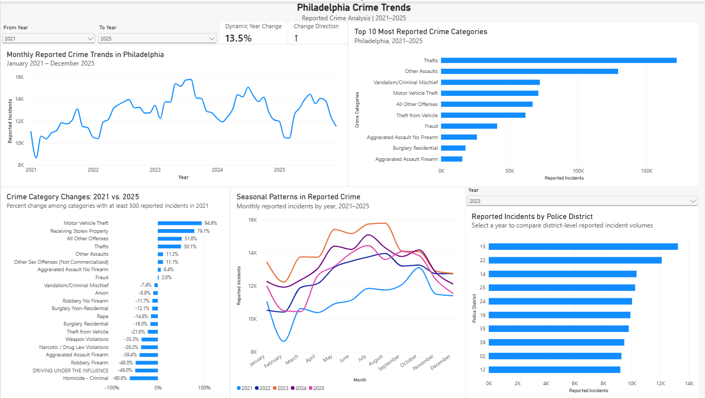
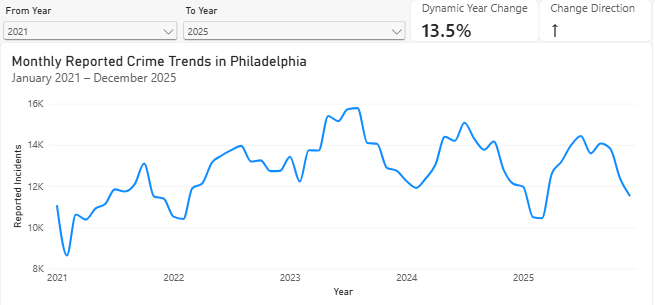
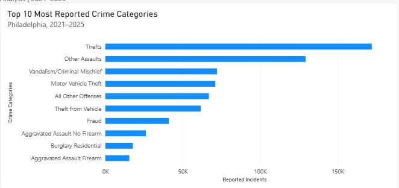
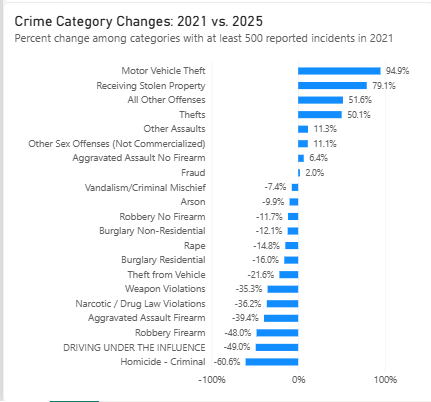
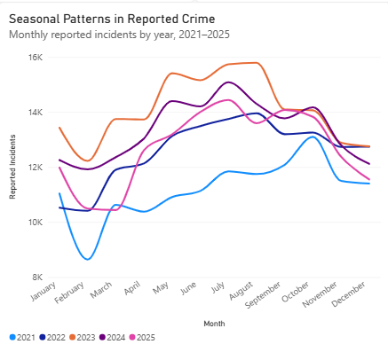
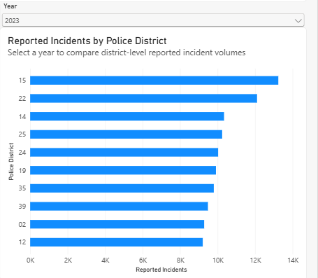

# Philadelphia Crime Trend Analysis

An analysis of Philadelphia reported crime incidents from **2021–2025** using MySQL and Power BI.

The project explores how reported crime changed over time, which crime categories were most frequently reported, how individual categories changed, whether monthly patterns suggest seasonality, and how reported incidents varied across police districts.

## Dashboard

## Business Questions

1. How has reported crime changed from 2021 to 2025?
2. Which crime categories were reported most often?
3. Which crime categories increased or decreased the most?
4. Are there seasonal patterns in reported crime?
5. Which police districts reported the most incidents?

## Tools

- **MySQL** — data loading, cleaning, validation, and analysis
- **Power BI** — data visualization and interactive dashboard
- **DAX** — calculated measures and year-over-year comparisons

## Data

The analysis uses Philadelphia Police Department crime incident data covering **January 2021 through December 2025**.

Five annual CSV files were combined and cleaned in MySQL, resulting in **767,500 reported incidents** used for the analysis.

The original data was obtained from the OpenDataPhilly Crime Incidents dataset.

> **Note:** This project analyzes reported incidents and should not be interpreted as representing every crime that occurred in Philadelphia.

## Data Preparation

The raw datasets were loaded into MySQL and inspected before analysis. Key preparation steps included:

- Standardizing date formats
- Converting fields to appropriate data types
- Converting blank values to `NULL`
- Standardizing incident IDs
- Removing exact duplicate rows
- Validating record counts and missing values

The `hour` field contained **102,107 missing values**, concentrated heavily in 2023. Because this could distort time-of-day comparisons, hour-based analysis was excluded from the final dashboard.

## Analysis & Key Findings

### Q1. How has reported crime changed from 2021 to 2025?

Reported incidents increased from 2021 through 2023, when they reached a five-year peak, before declining in 2024 and 2025. Despite the recent decline, reported incident volume in 2025 remained **13.5% higher than in 2021**.

### Q2. Which crime categories were reported most often?

**Thefts** were the most frequently reported category from 2021–2025, followed by **Other Assaults**. Several property-related offenses, including Motor Vehicle Theft and Theft from Vehicle, were also among the highest-volume categories.

> Frequency represents the number of reported incidents and should not be interpreted as crime severity.

### Q3. Which crime categories increased or decreased the most?

Changes varied considerably across crime categories. Among categories with at least **500 reported incidents in 2021**, Motor Vehicle Theft had the largest increase at **94.9%**, while Homicide – Criminal had the largest decrease at **60.6%** between 2021 and 2025.

The 500-incident threshold was used to reduce misleading percentage changes caused by categories with very small starting counts.

### Q4. Are there seasonal patterns in reported crime?

Reported incidents generally increased from the beginning of the year toward the spring and summer months before declining later in the year. The timing and size of these changes varied across years, suggesting a general seasonal pattern rather than an identical cycle each year.

### Q5. Which police districts reported the most incidents?

The geographic concentration of reported incidents changed over time. **District 22** recorded the highest volume in 2021, **District 15** ranked highest from 2022–2024, and **District 09** ranked highest in 2025. Across the full five-year period, District 15 recorded the highest total number of reported incidents.

> District totals are raw incident counts, not population-adjusted crime rates, and should not be interpreted as measures of how dangerous a district is.

## Key Takeaway

Philadelphia's reported incident volume rose through 2023 before declining in 2024 and 2025, but the overall pattern varied substantially by crime category and police district. The results show why citywide totals alone do not provide a complete picture of how reported crime changed over the five-year period.

## Limitations

- The dataset contains **reported incidents**, not every crime that occurred.
- Incident frequency does not measure the severity of an offense.
- District comparisons use raw counts rather than population-adjusted rates.
- The Q3 analysis uses a 500-incident baseline threshold to reduce distortions from small categories.
- Missing `hour` values, particularly in 2023, prevented reliable time-of-day analysis.

## Data Source

[Philadelphia Police Department Crime Incidents](https://opendataphilly.org/datasets/crime-incidents/) via OpenDataPhilly.
